# Pet Adoption

#### By Amelia Humphrey & Mariana Correa

## Introduction

The goal of our project is to explore the ‘Pet Adoption’ dataset to
better understand which pets have the best likelihood of adoption.
Animal shelters across the world are overcrowded, making it important to
identify what influences adoption. Our aim is to find factors that
impact a pet’s adoption likelihood, so shelters can better represent
underadopted pets. This analyze could help bring awareness to pet
adoption and increase the adoption rates for underadopted pets.

To achieve our goal, we are exploring the following key questions:

- What factors affect a pet’s likelihood of adoption?

- Which factor has the strongest influence on the length of time a pet
  spends in the shelter?

- How do adoption fees relate to a pet’s likelihood of adoption?

- How does a pet’s health condition relate to other factors in pet
  adoption?

We hope these findings will help us to conclude how shelters can best
help pets to b e adopted.

### Data Description

We are using a kaggle dataset created by Rabie El kharoua in 2024. This
dataset provides a comprehensive look into various factors that can
influence the likelihood of a pet being adopted from a shelter, covering
various characteristics and attributes.

Pet Adoption Link:
<https://www.kaggle.com/datasets/rabieelkharoua/predict-pet-adoption-status-dataset>

Citation:

Rabie El kharoua. (2024). 🐾 Predict Pet Adoption Status Dataset 🐾
\[Data set\]. Kaggle. <https://doi.org/10.34740/KAGGLE/DS/5242440>

``` r
pets <- read_csv("pet_adoption_data.csv")
```

    ## Rows: 2007 Columns: 13
    ## ── Column specification ────────────────────────────────────────────────────────
    ## Delimiter: ","
    ## chr (4): PetType, Breed, Color, Size
    ## dbl (9): PetID, AgeMonths, WeightKg, Vaccinated, HealthCondition, TimeInShel...
    ## 
    ## ℹ Use `spec()` to retrieve the full column specification for this data.
    ## ℹ Specify the column types or set `show_col_types = FALSE` to quiet this message.

``` r
head(pets)
```

    ## # A tibble: 6 × 13
    ##   PetID PetType Breed  AgeMonths Color Size  WeightKg Vaccinated HealthCondition
    ##   <dbl> <chr>   <chr>      <dbl> <chr> <chr>    <dbl>      <dbl>           <dbl>
    ## 1   500 Bird    Parak…       131 Oran… Large     5.04          1               0
    ## 2   501 Rabbit  Rabbit        73 White Large    16.1           0               0
    ## 3   502 Dog     Golde…       136 Oran… Medi…     2.08          0               0
    ## 4   503 Bird    Parak…        97 White Small     3.34          0               0
    ## 5   504 Rabbit  Rabbit       123 Gray  Large    20.5           0               0
    ## 6   505 Dog     Labra…        70 Brown Large    21.0           0               0
    ## # ℹ 4 more variables: TimeInShelterDays <dbl>, AdoptionFee <dbl>,
    ## #   PreviousOwner <dbl>, AdoptionLikelihood <dbl>

``` r
summary(pets)
```

    ##      PetID        PetType             Breed             AgeMonths     
    ##  Min.   : 500   Length:2007        Length:2007        Min.   :  1.00  
    ##  1st Qu.:1002   Class :character   Class :character   1st Qu.: 48.00  
    ##  Median :1503   Mode  :character   Mode  :character   Median : 94.00  
    ##  Mean   :1503                                         Mean   : 92.28  
    ##  3rd Qu.:2004                                         3rd Qu.:138.00  
    ##  Max.   :2506                                         Max.   :179.00  
    ##     Color               Size              WeightKg        Vaccinated   
    ##  Length:2007        Length:2007        Min.   : 1.018   Min.   :0.000  
    ##  Class :character   Class :character   1st Qu.: 8.730   1st Qu.:0.000  
    ##  Mode  :character   Mode  :character   Median :15.925   Median :1.000  
    ##                                        Mean   :15.706   Mean   :0.701  
    ##                                        3rd Qu.:22.737   3rd Qu.:1.000  
    ##                                        Max.   :29.996   Max.   :1.000  
    ##  HealthCondition  TimeInShelterDays  AdoptionFee    PreviousOwner   
    ##  Min.   :0.0000   Min.   : 1.00     Min.   :  0.0   Min.   :0.0000  
    ##  1st Qu.:0.0000   1st Qu.:21.00     1st Qu.:127.0   1st Qu.:0.0000  
    ##  Median :0.0000   Median :45.00     Median :242.0   Median :0.0000  
    ##  Mean   :0.1963   Mean   :43.97     Mean   :249.1   Mean   :0.3019  
    ##  3rd Qu.:0.0000   3rd Qu.:66.00     3rd Qu.:375.0   3rd Qu.:1.0000  
    ##  Max.   :1.0000   Max.   :89.00     Max.   :499.0   Max.   :1.0000  
    ##  AdoptionLikelihood
    ##  Min.   :0.0000    
    ##  1st Qu.:0.0000    
    ##  Median :0.0000    
    ##  Mean   :0.3284    
    ##  3rd Qu.:1.0000    
    ##  Max.   :1.0000

``` r
dim(pets)
```

    ## [1] 2007   13

## Cleaning

To clean the dataset, we checked for missing values, duplicates, and
outliers that could skew the data. We changed columns with binary ‘1’
and ‘0’ values to boolean values.

``` r
# Check for missing values
colSums(is.na(pets))
```

    ##              PetID            PetType              Breed          AgeMonths 
    ##                  0                  0                  0                  0 
    ##              Color               Size           WeightKg         Vaccinated 
    ##                  0                  0                  0                  0 
    ##    HealthCondition  TimeInShelterDays        AdoptionFee      PreviousOwner 
    ##                  0                  0                  0                  0 
    ## AdoptionLikelihood 
    ##                  0

There are no missing values in any of the columns of this dataset.

``` r
# Count duplicates
sum(duplicated(pets))
```

    ## [1] 0

There are no duplicate rows in this dataset.

``` r
# Convert binary
pets$Vaccinated <- as.logical(pets$Vaccinated)
pets$HealthCondition <- as.logical(pets$HealthCondition)
pets$PreviousOwner <- as.logical(pets$PreviousOwner)
pets$AdoptionLikelihood <- as.logical(pets$AdoptionLikelihood)
```

The columns `Vaccinated`, `HealthCondition`, `PreviousOwner` and
`AdoptionLikelihood` were changed from “0” and “1” to boolean values.

``` r
# Check datset
head(pets)
```

    ## # A tibble: 6 × 13
    ##   PetID PetType Breed  AgeMonths Color Size  WeightKg Vaccinated HealthCondition
    ##   <dbl> <chr>   <chr>      <dbl> <chr> <chr>    <dbl> <lgl>      <lgl>          
    ## 1   500 Bird    Parak…       131 Oran… Large     5.04 TRUE       FALSE          
    ## 2   501 Rabbit  Rabbit        73 White Large    16.1  FALSE      FALSE          
    ## 3   502 Dog     Golde…       136 Oran… Medi…     2.08 FALSE      FALSE          
    ## 4   503 Bird    Parak…        97 White Small     3.34 FALSE      FALSE          
    ## 5   504 Rabbit  Rabbit       123 Gray  Large    20.5  FALSE      FALSE          
    ## 6   505 Dog     Labra…        70 Brown Large    21.0  FALSE      FALSE          
    ## # ℹ 4 more variables: TimeInShelterDays <dbl>, AdoptionFee <dbl>,
    ## #   PreviousOwner <lgl>, AdoptionLikelihood <lgl>

``` r
summary(pets)
```

    ##      PetID        PetType             Breed             AgeMonths     
    ##  Min.   : 500   Length:2007        Length:2007        Min.   :  1.00  
    ##  1st Qu.:1002   Class :character   Class :character   1st Qu.: 48.00  
    ##  Median :1503   Mode  :character   Mode  :character   Median : 94.00  
    ##  Mean   :1503                                         Mean   : 92.28  
    ##  3rd Qu.:2004                                         3rd Qu.:138.00  
    ##  Max.   :2506                                         Max.   :179.00  
    ##     Color               Size              WeightKg      Vaccinated     
    ##  Length:2007        Length:2007        Min.   : 1.018   Mode :logical  
    ##  Class :character   Class :character   1st Qu.: 8.730   FALSE:600      
    ##  Mode  :character   Mode  :character   Median :15.925   TRUE :1407     
    ##                                        Mean   :15.706                  
    ##                                        3rd Qu.:22.737                  
    ##                                        Max.   :29.996                  
    ##  HealthCondition TimeInShelterDays  AdoptionFee    PreviousOwner  
    ##  Mode :logical   Min.   : 1.00     Min.   :  0.0   Mode :logical  
    ##  FALSE:1613      1st Qu.:21.00     1st Qu.:127.0   FALSE:1401     
    ##  TRUE :394       Median :45.00     Median :242.0   TRUE :606      
    ##                  Mean   :43.97     Mean   :249.1                  
    ##                  3rd Qu.:66.00     3rd Qu.:375.0                  
    ##                  Max.   :89.00     Max.   :499.0                  
    ##  AdoptionLikelihood
    ##  Mode :logical     
    ##  FALSE:1348        
    ##  TRUE :659         
    ##                    
    ##                    
    ## 

``` r
dim(pets)
```

    ## [1] 2007   13

Our variable after cleaning:

1.  **PetID:** Unique identifier for each pet.

2.  **PetType:** Type of pet (e.g., Dog, Cat, Bird, Rabbit).

3.  **Breed:** Specific breed of the pet.

4.  **AgeMonths:** Age of the pet in months.

5.  **Color:** Color of the pet.

6.  **Size:** Size category of the pet (Small, Medium, Large).

7.  **WeightKg:** Weight of the pet in kilograms.

8.  **Vaccinated:** Vaccination status of the pet (0 - Not vaccinated,
    1 - Vaccinated).

9.  **HealthCondition:** Health condition of the pet (0 - Healthy, 1 -
    Medical condition).

10. **TimeInShelterDays:** Duration the pet has been in the shelter
    (days).

11. **AdoptionFee:** Adoption fee charged for the pet (in dollars).

12. **PreviousOwner:** Whether the pet had a previous owner (0 - No, 1 -
    Yes).

13. **AdoptionLikelihood:** Likelihood of the pet being adopted (0 -
    Unlikely, 1 - Likely).

An initial view of the number of pets in the data type and what type of
animals are in the animal shelter.

``` r
pets |>
  ggplot(aes(x = PetType, fill = PetType)) +
  geom_bar() +
  ggtitle("Number of Pets by Pet Type") +
  xlab("Pet Type") 
```

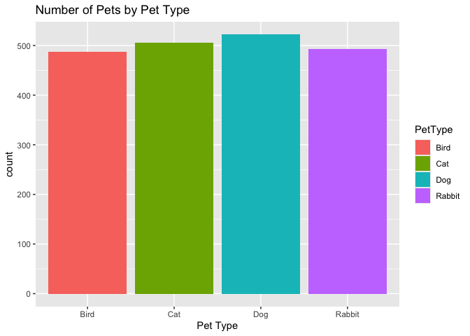<!-- -->

``` r
pets |>
  ggplot(aes(x = Breed, fill = Breed)) +
  geom_bar() +
  ggtitle("Number of Pets by Pet Type") +
  xlab("Breeds") +
  theme(axis.text.x = element_text(angle = 45, vjust = 1, hjust = 1))
```

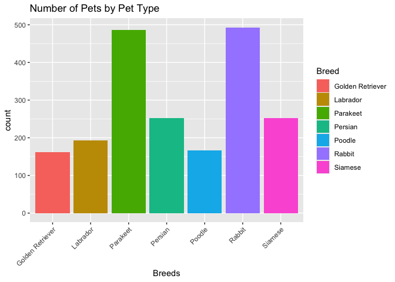<!-- -->

These graphs show the pet type and breed distribution in the dataset.
The most common breeds in the datasets are parakeet and rabbit. The pet
type that is most common at the shelter is dogs followed closest by
cats.

### Research Questions:

1.  **What factors impact the likelihood of adoption? Does a longer time
    in shelter decrease the likelihood of adoption? What type of animal
    is most likely to get adopted? How does the likelihood vary between
    breed for the same pet type? Is there a certain pet color that is
    more likely to be adopted?**

``` r
#On average how likely is a pet to be adopted?
mean(pets$AdoptionLikelihood)
```

    ## [1] 0.3283508

``` r
#is shelter time correlated to adoptionLikelihood?
cor(pets$TimeInShelterDays, pets$AdoptionLikelihood)
```

    ## [1] 0.008867397

``` r
#which pet type is most likely to be adopted?

 RateAdoption <-pets |> 
  group_by(PetType) |> 
  summarize(
    n = n(),
    adoptionRate = mean(AdoptionLikelihood)
  ) |> 
  arrange(desc(adoptionRate))
 RateAdoption
```

    ## # A tibble: 4 × 3
    ##   PetType     n adoptionRate
    ##   <chr>   <int>        <dbl>
    ## 1 Dog       522        0.464
    ## 2 Bird      487        0.302
    ## 3 Cat       505        0.287
    ## 4 Rabbit    493        0.254

``` r
 RateAdoption |> 
  ggplot(aes(x=adoptionRate, y = PetType)) +
  geom_col(fill = rgb(17, 202, 160, maxColorValue = 255)) + 
  ggtitle("Pet Type and Adoption Rate") +
  xlab("Adoption Rate")  +
  ylab("Pet Type")
```

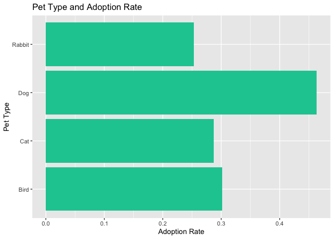<!-- -->

A pet is on average, 32.8% likely to be adopted. The time in the
shelter’s correlation to adoption likelihood is practically nonexistent
with a value of 0.009. The type of pet most likely to be adopted is
dogs, at 46.4%, and the least likely pet to be adopted is rabbits, at
25.4%.

``` r
pets |> 
  filter(PetType == "Dog") |> 
  group_by(Breed) |> 
  summarise(
    n = n(),
    rate  = mean(AdoptionLikelihood)
  ) |> 
  arrange(desc(rate)) |> 
  ggplot(aes(x = Breed, y = rate)) + 
  geom_col(fill = rgb(196, 146, 177, maxColorValue = 255)) + 
  ggtitle("Breed and Adoption Rate for Dogs")+
  ylab("Adoption Rate")  +
theme(axis.text.x = element_text(angle = 45, vjust = 1, hjust = 1))
```

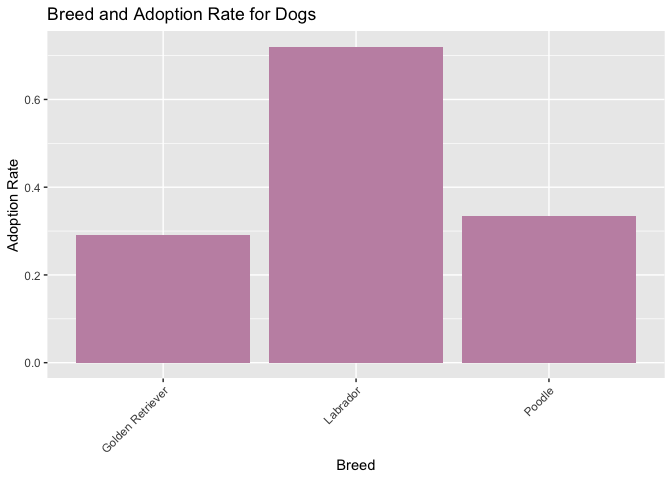<!-- -->

``` r
pets |> 
  filter(PetType == "Cat") |> 
  group_by(Breed) |> 
  summarise(
    n = n(),
    rate  = mean(AdoptionLikelihood)
  ) |> 
  arrange(desc(rate))  |> 
  ggplot(aes(x = Breed, y = rate)) + 
  geom_col(fill = rgb(17, 202, 160, maxColorValue = 255)) + 
  ggtitle("Breed and Adoption Rate for Cats")+
  ylab("Adoption Rate")
```

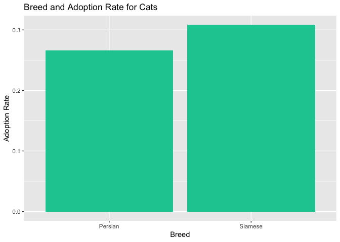<!-- -->

These graphs show the adoption likelihoods for different types of breeds
by pet type. Birds and rabbits do not have graphs, as each only have one
breed. From the dog graph, it is clear that Labradors are the most
likely dog breed to be adopted with around 73% likely. The cat graph
displays that Siamese are more likely to be adopted in comparison to
Persian cats. These graphs show that Persian cats and Golden Retrievers
could use more marketing to help increase their adoption numbers.

``` r
pets |> 
  group_by(Color) |> 
  summarise(
    n = n(),
    rate = mean(AdoptionLikelihood)
  ) |> 
  arrange(desc(rate)) |> 
  ggplot(aes(x = rate, y= Color, fill = Color)) + 
  geom_col() +
   scale_fill_manual(values= c("Black" = "black", "Brown" = "burlywood4", "Gray" = "gray80", "Orange" = "darkorange" , "White" = "cornsilk" ))+ 
  theme(legend.position = "none") +
  ggtitle("Color and Adoption") + 
  xlab("Adoption Rate")
```

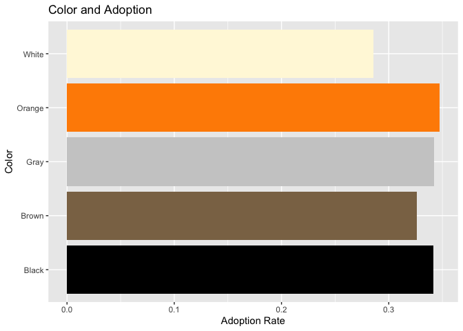<!-- -->

``` r
pets |> 
  filter(PetType == "Dog", Color == "Brown") |> 
  summarize(
    rate = mean(AdoptionLikelihood)
  )
```

    ## # A tibble: 1 × 1
    ##    rate
    ##   <dbl>
    ## 1 0.506

``` r
#facet moment
pets |> 
  group_by(PetType, Color) |> 
  summarise(
    n = n(),
    rate = mean(AdoptionLikelihood)
  ) |> 
  ggplot(aes(x= Color, y = rate, fill = Color))  +
  geom_col() + 
  scale_fill_manual(values= c("Black" = "black", "Brown" = "burlywood4", "Gray" = "gray80", "Orange" = "darkorange" , "White" = "cornsilk" )) +
  facet_wrap(~PetType) +
  theme(axis.text.x = element_text(angle = 90, vjust = 0.5, hjust = 1)) + 
  ggtitle("Color vs Average Adoption Likelihood")+
  ylab("Average Adoption Likelihood")
```

    ## `summarise()` has regrouped the output.
    ## ℹ Summaries were computed grouped by PetType and Color.
    ## ℹ Output is grouped by PetType.
    ## ℹ Use `summarise(.groups = "drop_last")` to silence this message.
    ## ℹ Use `summarise(.by = c(PetType, Color))` for per-operation grouping
    ##   (`?dplyr::dplyr_by`) instead.

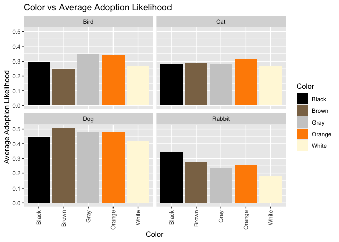<!-- -->

``` r
pets |> 
  filter(PetType == "Dog", Color == "Brown") |> 
  summarize(
    rate = mean(AdoptionLikelihood)
  )
```

    ## # A tibble: 1 × 1
    ##    rate
    ##   <dbl>
    ## 1 0.506

The top graph shows a general color breakdown by adoption likelihood
with orange pets being the most likely and white pets being the least
likely. The second graph facets by pet type, showing that brown dogs are
the most likely to be adopted. White rabbits are less likely to be
adopted than other pets and, within rabbits, less likely than other
colors. These findings suggest the white rabbit should be shown first to
potential owners in hopes are increased odds of adoption.

``` r
most_adopted <- pets |> 
  group_by(PetType, Breed, Color) |> 
  summarise(
    rate = mean(AdoptionLikelihood, na.rm = TRUE),
    n = n(),
    .groups = "drop"
  ) |> 
  arrange(desc(rate))
most_adopted
```

    ## # A tibble: 35 × 5
    ##    PetType Breed            Color   rate     n
    ##    <chr>   <chr>            <chr>  <dbl> <int>
    ##  1 Dog     Labrador         Brown  0.833    36
    ##  2 Dog     Labrador         Black  0.744    39
    ##  3 Dog     Labrador         White  0.697    33
    ##  4 Dog     Labrador         Gray   0.683    41
    ##  5 Dog     Labrador         Orange 0.659    44
    ##  6 Dog     Poodle           Gray   0.457    35
    ##  7 Dog     Poodle           Orange 0.4      30
    ##  8 Dog     Golden Retriever Black  0.353    34
    ##  9 Bird    Parakeet         Gray   0.347    98
    ## 10 Cat     Siamese          Black  0.344    61
    ## # ℹ 25 more rows

``` r
#top 15 to plot
most_adopted |> 
  slice_max(rate, n = 15) |> 
  ggplot(aes(x = reorder(paste(PetType, Breed, Color, sep = "/"), rate), y= rate, fill = PetType)) + 
  geom_col()+
  coord_flip()+
  labs(
    title = "Most Adoptable Pet",
    x = "Pet",
    y = "Average Adoption Likilihood"
  ) + theme_minimal()
```

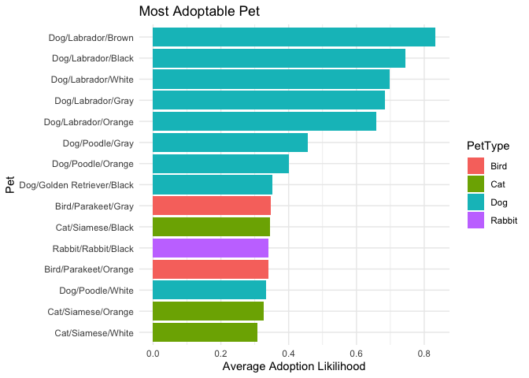<!-- -->

This graph displays the top 15 combinations of pet type, breed, and
color that are most likely to be adopted. From the graph, it can be
extracted that the most likely pet to be adopted in the shelter is a
Brown Labrador with over 80%. The least likely dog to be adopted is a
white poodle.

2.  **What factor has the largest impact on time spent in the shelter?
    Is age a contributor? What breed is more likely to spend a long time
    in the shelter? Does health condition impact the time spent in
    shelter?**

``` r
pets |> 
  ggplot(aes(x = TimeInShelterDays))  +
  geom_histogram(binwidth = 6, fill = rgb(196, 146, 177, maxColorValue = 255)) + 
  ggtitle("Time Spent in Shelter") + 
  ylab("Number of Pets")
```

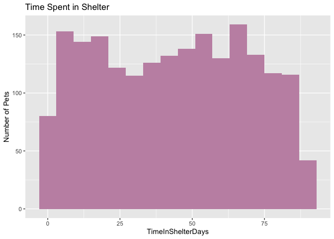<!-- -->

This graph displays how many pets stay for a certain number of days. The
graph looks bimodal, with peaks around 15-25 days and 60-65 days. The
large drops indicate that adoption has increased.

``` r
pets |> 
  ggplot(aes(x = TimeInShelterDays))  +
  geom_histogram(binwidth = 6, fill = rgb(196, 146, 177, maxColorValue = 255)) + 
  facet_wrap(~PetType) +
  ggtitle("Time Spent in Shelter") + 
  ylab("Number of Pets")  
```

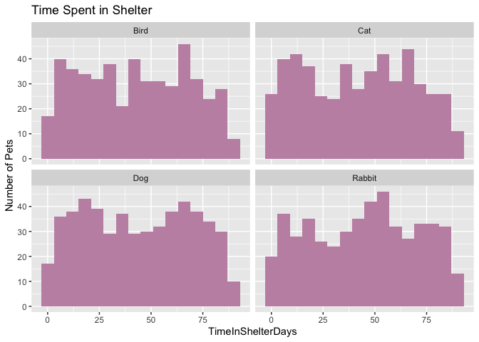<!-- -->

This graph shows the number of days a pet has stayed faceted by pet
type.

``` r
pets |> 
  group_by(PetType) |> 
  summarise(
    n = n(),
    avgDays = mean(TimeInShelterDays),
    medianDays = median(TimeInShelterDays)
  ) |> 
  arrange(desc(avgDays)) |> 
  ggplot(aes(x = PetType, y = avgDays)) + 
  geom_col(fill = rgb(180, 205, 205, maxColorValue = 255)) + 
  ggtitle("Mean Time in Shelter by Pet Type") + 
  ylab("Mean") 
```

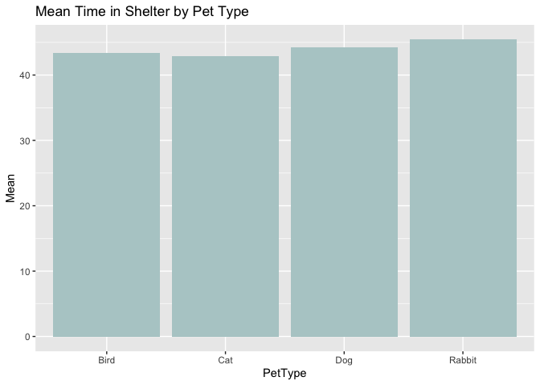<!-- -->

The graph shows the average time a pet type spends in the shelter.
Rabbits have the longest average stay time, but all the animals spend
about the same amount on average in the shelter (within 10 days).

``` r
pets |> 
  group_by(Breed) |> 
  summarise(
    n = n(),
    avgDays = mean(TimeInShelterDays),
    medianDays = median(TimeInShelterDays)
  ) |> 
  arrange(desc(avgDays)) |> 
  ggplot(aes(x = Breed, y = avgDays)) + 
  geom_col(fill = rgb(0, 80, 136, maxColorValue = 255)) + 
  ggtitle("Mean Time in Shelter by Breed") + 
  ylab("Mean") + 
  theme(axis.text.x = element_text(angle = 45, vjust = 1, hjust = 1))
```

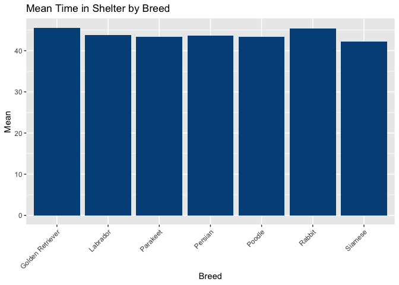<!-- -->

The graph was created to see if there is a certain breed that has
abnormally long stays. The graph shows that all of the breeds are within
10 days of average shelter time. This means that not one type of breed
is particularly, not adopted quickly.

``` r
cor(pets$AgeMonths, pets$TimeInShelterDays, use = "complete.obs")
```

    ## [1] 0.03683713

``` r
cor(pets$WeightKg, pets$TimeInShelterDays, use = "complete.obs")
```

    ## [1] -0.000979996

``` r
cor(pets$AdoptionFee, pets$TimeInShelterDays, use = "complete.obs")
```

    ## [1] -0.007104482

``` r
#shows the randomness/lack of correlation
pets |> 
  ggplot(aes(x = AgeMonths, y = TimeInShelterDays)) + 
  geom_point() +
  geom_smooth(method = "lm", se = FALSE, color = "dodgerblue3") +
  facet_wrap(~PetType) + 
  ggtitle("Age vs Time in Shelter") + 
  xlab("Age (months)")  +
  ylab("Time in Shelter (days)")
```

    ## `geom_smooth()` using formula = 'y ~ x'

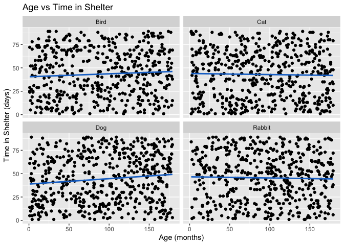<!-- -->

This graph shows that the age of an animal has little to no relevance to
the amount of time said animal stays in the shelter. The regression
lines show decently horizontal lines for all the pet types. The pet type
with the largest correlation is dogs, with a slightly positive slope.

``` r
#Does being old increase shelter time 

pets |> 
  mutate(AgeGroups = if_else(AgeMonths <24, "Young(<2 years old)", if_else(AgeMonths < 84, "Adult (2-7 years)", "Old(>7 years old"))) |> 
  group_by(AgeGroups) |> 
  summarise(
    median = median(TimeInShelterDays)
  )  |> 
  ggplot(aes(x = AgeGroups, y = median)) + 
  geom_col() + 
  ggtitle("Age Groups and Time in Shelter")
```

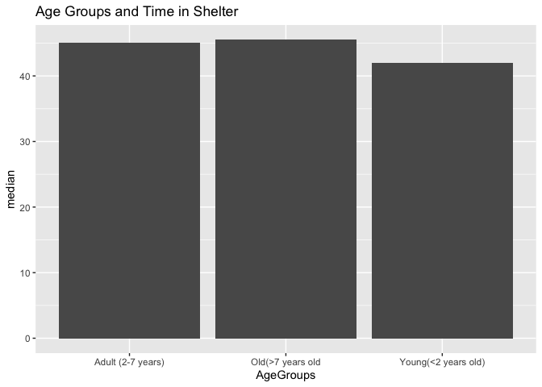<!-- -->

This graph displays that younger pets (under 2) tend to spend less time
in the shelter. This graph was created to see whether older pets are
more likely to spend a longer time in the shelter. The data does support
that assumption, but not significantly, as adult pets have a similar
median.

``` r
#long stay calculate top 10% of the total time shelter
pets2 <- pets |> 
  mutate(LongStay = TimeInShelterDays >= quantile(TimeInShelterDays, 0.9, na.rm = TRUE))


#Is there a breed that typical stays longer 

LongStayBreed <- pets2 |>
  group_by(Breed) |> 
  summarise(
    n = n(),
    medianDays = median(TimeInShelterDays), longStayRate = mean(LongStay),
    avgDays  =  mean(TimeInShelterDays)
  ) |> 
  arrange(desc(medianDays))
LongStayBreed
```

    ## # A tibble: 7 × 5
    ##   Breed                n medianDays longStayRate avgDays
    ##   <chr>            <int>      <dbl>        <dbl>   <dbl>
    ## 1 Golden Retriever   162       48         0.0988    45.6
    ## 2 Rabbit             493       48         0.114     45.4
    ## 3 Persian            252       45.5       0.107     43.6
    ## 4 Parakeet           487       43         0.107     43.3
    ## 5 Poodle             167       43         0.0719    43.4
    ## 6 Siamese            253       43         0.111     42.2
    ## 7 Labrador           193       42         0.155     43.8

``` r
LongStayBreed |> 
  filter(n >=30) |> 
  arrange(desc(longStayRate)) |> 
  ggplot(aes(x = longStayRate, y = reorder(Breed, longStayRate))) +
  geom_bar(stat = "identity", fill = rgb(0, 80, 136, maxColorValue = 255) ) + 
  coord_flip()+theme(axis.text.x = element_text(angle = 45, vjust = 1, hjust = 1)) +
  xlab("Long Stay Rate") +
  ylab("Breed") + 
  ggtitle("Long Stay Rate and Breed")
```

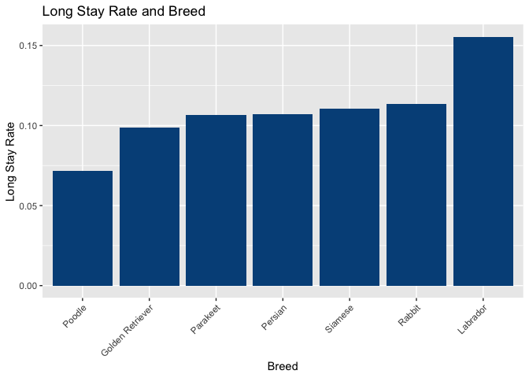<!-- -->

Long Stays are the top 10% of time spent in the shelter. The graph shows
that Labradors are the breed with the most Long Stay residents with
around 15% of long stay pets are Labrador. The least likely to have a
long stay is Poodles.

``` r
#Does having a healthCondition impact shelter time?

pets |> 
  group_by(HealthCondition) |> 
  summarise(
    n = n(),
    avgDays = mean(TimeInShelterDays),
    medianDays = median(TimeInShelterDays)
  ) 
```

    ## # A tibble: 2 × 4
    ##   HealthCondition     n avgDays medianDays
    ##   <lgl>           <int>   <dbl>      <dbl>
    ## 1 FALSE            1613    44.1         45
    ## 2 TRUE              394    43.3         45

``` r
pets |> 
  ggplot(aes(x = factor(HealthCondition), y = TimeInShelterDays, fill = factor(HealthCondition)))+
  geom_boxplot() + 
  xlab("Health Condition") + 
  labs(fill = "Health Condition") + 
  ggtitle("Time In Shelter and Health Condition")
```

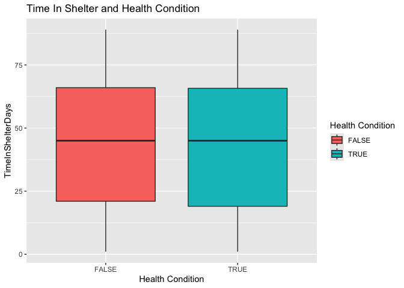<!-- -->

The ranges on the boxplots and the medians are relative the same thus
there is no significant impact of health condition on the amount of
shelter days.

``` r
#add titles and colors 
pets |> 
  ggplot(aes(x = factor(HealthCondition), y = TimeInShelterDays, fill = factor(HealthCondition))) +
  geom_boxplot() +
  coord_flip()+
  facet_wrap(~PetType)  +
  xlab("Health Condition") + 
  ggtitle("Time In Shelter and Health Condition") + 
  labs(fill = "Health Condition")
```

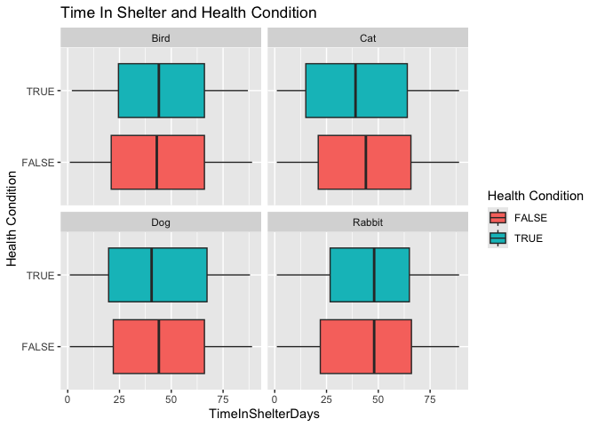<!-- -->

The graph shows that having a health condition does not drastically
impact the amount of time animal spend in the shelter regardless of the
type of pet. Although the cats and dogs are slightly more likely to
spend less time in the shelter if they are healthy.

3.  **Is there a breed that has a larger adoption fee? Does the adoption
    fee have any correlation to the size of the pet? Do pets with higher
    adoption fees have better health conditions/are vaccinated? Does the
    color of the pet impact the adoption fee?**

``` r
# Is there a breed that has a larger adoption fee?
# Using median fee to avoid skewness from outliers
pets |> 
  group_by(Breed, PetType) |>
  summarise(
    n = n(),
    avgFee = mean(AdoptionFee),
    medianFee = median(AdoptionFee),
    .groups = 'drop'
  ) |> 
  mutate(BreedLabel = paste0(Breed, " (", PetType, ")")) |>
  arrange(desc(medianFee)) |> 
  ggplot(aes(x = reorder(BreedLabel, medianFee), y = medianFee)) + 
  geom_col(fill = "lightseagreen") + 
  coord_flip() + 
  ggtitle("Median Adoption Fee by Breed") +
  xlab("Breed (Pet Type)") +
  ylab("Median Adoption Fee ($)")
```

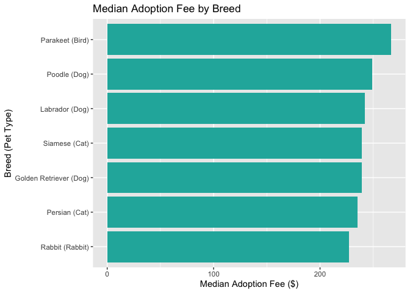<!-- -->

``` r
# Does the adoption fee have any correlation to the size of the pet?
cor(pets$WeightKg, pets$AdoptionFee, use = "complete.obs")
```

    ## [1] -0.002367119

``` r
pets |> 
  ggplot(aes(x = WeightKg, y = AdoptionFee)) +
  geom_point(alpha = 0.5, color = "sienna") +
  geom_smooth(method = "lm", color = "black", se = FALSE) +
  facet_wrap(~PetType) + 
  ggtitle("Adoption Fee vs. Pet Weight by Pet Type") +
  xlab("Weight (Kg)") +
  ylab("Adoption Fee ($)")
```

    ## `geom_smooth()` using formula = 'y ~ x'

<!-- -->

``` r
# Do pets with higher adoption fees have better health conditions/are vaccinated?
pets |> 
  ggplot(aes(x = HealthCondition, y = AdoptionFee, fill = HealthCondition)) +
  geom_boxplot() +
  ggtitle("Adoption Fee by Health Condition") +
  xlab("Health Condition") +
  ylab("Adoption Fee ($)")
```

<!-- -->

``` r
pets |> 
  ggplot(aes(x = Vaccinated, y = AdoptionFee, fill = Vaccinated)) +
  geom_boxplot() +
  scale_fill_manual(values = c("FALSE" = "tomato", "TRUE" = "springgreen4")) +
  ggtitle("Adoption Fee by Vaccination Status") +
  xlab("Vaccinated") +
  ylab("Adoption Fee ($)")
```

<!-- -->

``` r
# Does the color of the pet impact the adoption fee?
pets |> 
  ggplot(aes(x = reorder(Color, AdoptionFee, FUN = median), y = AdoptionFee, fill = Color)) +
  geom_boxplot() +
  scale_fill_manual(values= c("Black" = "grey30", "Brown" = "burlywood4", 
                              "Gray" = "gray70", "Orange" = "darkorange", "White" = "wheat1")) +
  ggtitle("Adoption Fee Distribution by Color") +
  xlab("Color") +
  ylab("Adoption Fee ($)") +
  theme(legend.position = "none")
```

<!-- -->

``` r
# Does adoption fee impact the likelihood of adoption?
pets |> 
  ggplot(aes(x = AdoptionLikelihood, y = AdoptionFee, fill = AdoptionLikelihood)) +
  geom_boxplot() +
  scale_fill_manual(values = c("FALSE" = "tomato", "TRUE" = "springgreen4")) +
  ggtitle("Adoption Fee by Adoption Likelihood") +
  xlab("Adoption Likelihood") +
  ylab("Adoption Fee ($)")
```

<!-- -->

4.  **Which type of pets are most likely to be healthy (HealthCondition
    = 1), and how does that connect to the time spent in the shelter?
    Are medical consitions more common among older animals across all
    pet types? Are certain breeds more likely to have a medical
    condition?**

``` r
# Which type of pets are most likely to be healthy (HealthCondition = FALSE)?
pets |> 
  group_by(PetType) |> 
  summarise(
    n = n(),
    HealthRate = 1 - mean(HealthCondition) 
  ) |> 
  arrange(desc(HealthRate)) |> 
  ggplot(aes(x = reorder(PetType, HealthRate), y = HealthRate)) +
  geom_col(fill = "mediumpurple3") +
  ggtitle("Proportion of Healthy Pets by Pet Type") +
  xlab("Pet Type") +
  ylab("Proportion Healthy")
```

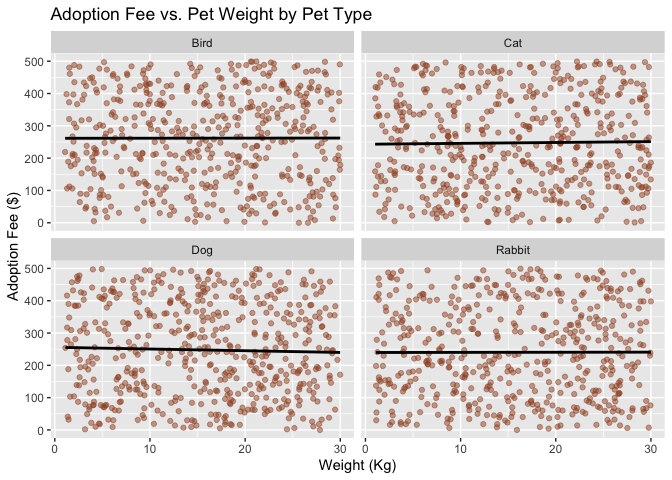<!-- -->

``` r
# How does that connect to the time spent in the shelter?
pets |> 
  ggplot(aes(x = HealthCondition, y = TimeInShelterDays, fill = HealthCondition)) +
  geom_boxplot() +
  scale_fill_manual(values = c("FALSE" = "springgreen4", "TRUE" = "tomato")) +
  facet_wrap(~PetType) +
  ggtitle("Time in Shelter by Medical Condition and Pet Type") +
  xlab("Medical Condition") +
  ylab("Time in Shelter (Days)")
```

<!-- -->

``` r
# Are medical conditions more common among older animals across all pet types?
pets |> 
  mutate(AgeGroups = if_else(AgeMonths < 24, "Young (<2 years)", 
                     if_else(AgeMonths < 84, "Adult (2-7 years)", "Old (>7 years)"))) |>
  mutate(AgeGroups = factor(AgeGroups, levels = c("Young (<2 years)", "Adult (2-7 years)", "Old (>7 years)"))) |>
  group_by(AgeGroups, PetType) |> 
  summarise(
    n = n(),
    MedicalConditionRate = mean(HealthCondition), 
    .groups = 'drop'
  ) |> 
  ggplot(aes(x = AgeGroups, y = MedicalConditionRate, fill = PetType)) +
  geom_col(position = "dodge") + 
  ggtitle("Rate of Medical Conditions by Age Group and Pet Type") +
  xlab("Age Group") +
  ylab("Proportion with Medical Condition")
```

<!-- -->

``` r
# Are certain breeds more likely to have a medical condition?
pets |> 
  group_by(Breed, PetType) |>
  summarise(
    n = n(),
    MedicalConditionRate = mean(HealthCondition),
    .groups = 'drop'
  ) |> 
  mutate(BreedLabel = paste0(Breed, " (", PetType, ")")) |>
  arrange(desc(MedicalConditionRate)) |> 
  ggplot(aes(x = reorder(BreedLabel, MedicalConditionRate), y = MedicalConditionRate)) +
  geom_col(fill = "indianred") +
  coord_flip() +
  ggtitle("Proportion of Pets with Medical Conditions by Breed") +
  xlab("Breed (Pet Type)") +
  ylab("Proportion with Medical Condition")
```

<!-- -->

``` r
# Does health condition impact the likelihood of adoption?
pets |> 
  group_by(HealthCondition) |> 
  summarise(
    n = n(),
    AdoptionRate = mean(AdoptionLikelihood)
  ) |> 
  ggplot(aes(x = HealthCondition, y = AdoptionRate, fill = HealthCondition)) +
  geom_col(color = "black") + 
  scale_fill_manual(values = c("FALSE" = "springgreen4", "TRUE" = "tomato")) +
  ggtitle("Adoption Rate by Health Condition") +
  xlab("Medical Condition") +
  ylab("Adoption Rate") +
  theme(legend.position = "none")
```

<!-- -->

## Conclusion

After analyzing and cleaning the dataset, the results suggest that a
pet’s health condition is the most important factor that shelters can
influence to improve adoption rates.

- Health and Pet Type are The Biggest Drivers of Adoption

  - The data show that pet type and health status are the most critical
    factors in adoption. Dogs and animals with no health conditions are
    more likely to find a home. 

- Time in Shelter is Unpredictable

  - Variables like a pet’s age, adoption fee, and medical condition show
    little to no correlation with how many days they spend in the
    shelter.

- Adoption Fees are Static

  - Fees are not adjusted based on a pet’s size, vaccination status, or
    medical needs, and the cost does not positively or negatively
    influence a pet’s chance of being adopted.

- Predicting Adoption Requires More

  - Since there are few strong trends, a pet’s likelihood of being
    adopted is likely based on complex combinations of variables. For an
    accurate prediction, we would need advanced machine learning models.
